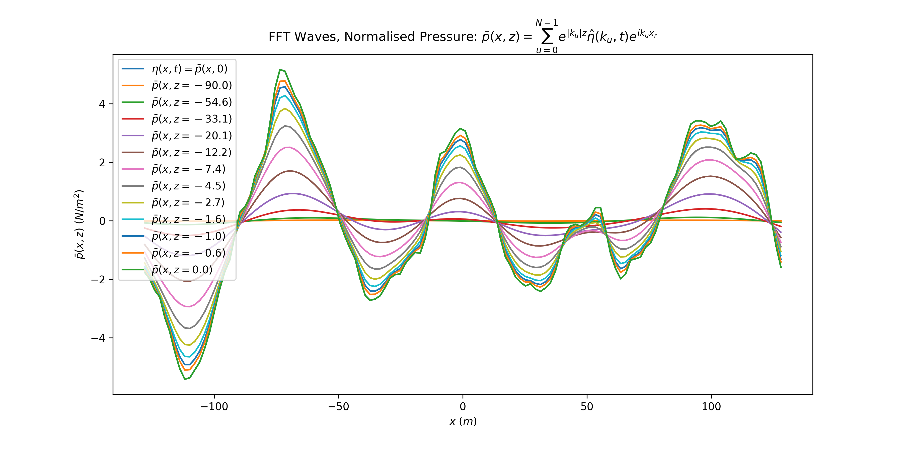
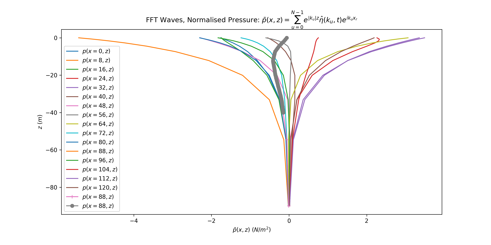

# Nonlinear Froude-Krylov Forces with FFT Waves

---

Author: Rhys Mainwaring\
Date: 7 November 2022

---

A FFT is used to sum the amplitudes for irregular waves in asv_wave_sim
using the methods developed by Tessendorf and described in detail by Mobley.

Here we outline the calculation needed for the nonlinear Froude-Krylov force
and describe some of the challenges. We review the 2D case as the notation is
simpler.

## Two dimensional time dependent irregular waves

For consistency with our hydrodynamics notes we use the symbols
$\eta(x, t)$ and $\hat{\eta}(k, t)$ for the
wave elevation and its spatial Fourier transform instead of
$z(x, t)$ and $\hat{z}(k, t)$ used in Tessendorf's paper.

Wave are calculated on a grid length $L$ sampled at $N$ equal intervals
of size $\Delta x = L/N$:

```math
\begin{equation}
x_r = (1, 2, ..., N - 1) \cdot \Delta x.
\end{equation}
```

The frequency domain is sampled by $N$ spatial angular wavenumbers
$k_u$ with spacing $\Delta k = 2 \pi/L$ and includes both postive and
negative frequencies. The math ordered frequencies are:

```math
\begin{equation}
k_u =(-\frac{N}{2}, -\frac{N}{2} + 1, ...,0, 1, ..., \frac{N}{2} - 1)
\cdot \Delta k.
\end{equation}
```

The expression for the wave elevation in terms of a discrete Fourier transform
(DFT) is:

```math
\begin{equation}
\eta(x_r, t)
= \sum_{u=0}^{N-1} \hat{\eta}(k_u, t) e^{i k_u x_r}
= \sum_{u=0}^{N-1} \hat{\eta}(k_u, t) e^{i 2 \pi u r / N},
\end{equation}
```

where the time dependent Hermitian amplitudes are:

```math
\begin{equation}
 \hat{\eta}(k_u, t) = \frac{1}{\sqrt{2}}
 \left(
\hat{\eta}_{0}(k_u) e^{-i \omega_u t}
+ \hat{\eta}^{*}_{0}(-k_u) e^{i \omega_u t}
\right),
\end{equation}
```

and the time independent Hermitian amplitudes with random scale and phase
are:

```math
\begin{equation}
\hat{\eta}_{0}(k_u) = \frac{1}{\sqrt{2}}
\left(\rho(k_u) + i \sigma(k_u)\right) \sqrt{\Psi_{2s}(k_u)}.
\end{equation}
```

The independent Gaussian random variables $\rho(k_u)$ and $\sigma(k_u)$ are 
distributed $\cal{N}(0, 1)$ and $\Psi_{2s}(k_u)$ is the continuous
two-sided wave variance spectrum. The temporal angular frequencies
$\omega_u > 0$ are given by the deep water dispersion relation:

```math
\begin{equation}
\omega_u = \omega(k_u) = \left(k_u g\right)^{1/2}.
\end{equation}
```

Recall that for a single frequency, the contribution to the pressure from the potential for the incident wave is:

```math
\begin{equation}
p = -\rho \frac{\partial \phi}{\partial t} = \rho g e^{k z} \eta(x, t).
\end{equation}
```

The extension to a superposition of waves summed using a DFT is:


```math
\begin{equation}
p = \rho g \sum_{u=0}^{N-1} e^{|k_u| z} \hat{\eta}(k_u, t) e^{i k_u x_r}.
\end{equation}
```

The $|k_u|$ appears in the exponential because the DFT includes both
positive and negative frequencies and the pressure must remain bounded as the
depth increases (where $z$ is large and negative). In the nonlinear
case we make the replacement $z \rightarrow z' = z - \eta(x, t)$.

To calculate the nonlinear buoyancy and Froude-Krylov hydrodynamic forces
both (Eq. 3) and (Eq. 8) must be evaluated at the centroid
$c = (x_{c}, z_{c})$ for each mesh element (panel)
of the floating body.

- The wave elevation (Eq. 3) can be evaluated once at
a sample of grid points and interpolated.

- The pressure calculation is more challenging as it is a function of the
each centroid's depth $z_{c}$. Evaluating (Eq. 8) either directly or using
a FFT for each mesh element is prohibitive.

## Implementation

The pressure at a fixed depth $z$ can be calculated at the points $x_r$ of the 
sample grid by a minor modification to a routine for calculating wave elevation
via FFT. The figures below show results for 2D waves on a grid with
L=256, N=128 and wind speed u19=10.0 at a number of depths.

Figure 1. Normalised pressure vs position for 2D FFT waves. 



Figure 2. Normalised pressure vs depth for 2D FFT waves. 



The normalised pressure is bounded $0 \le |\bar{p}(x, t)| \le \eta(x, t)$ and
decays exponentially with depth, but unlike the single frequency case the
decay is not always monotonic.

At a computational cost of $M$ additional FFT evaluations, the pressure
at each centroid $c = (x_c, z_c)$ may calculated by generating pressure
grids a set of fixed depths $z_0, z_1, ...,z_M$ and interpolating.
